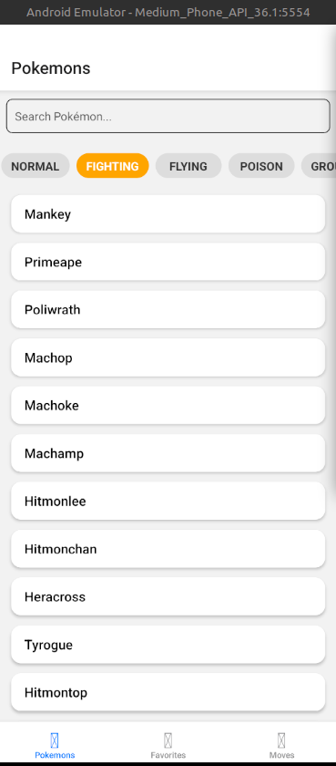
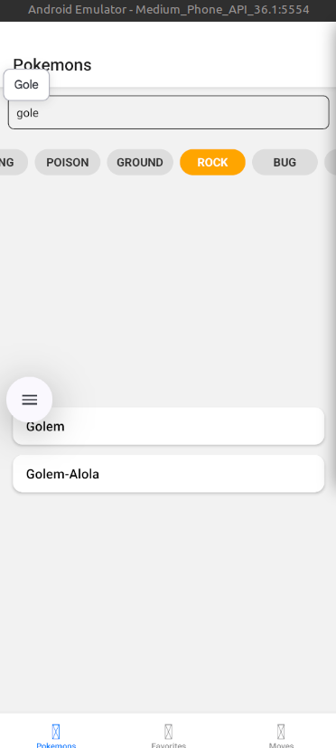
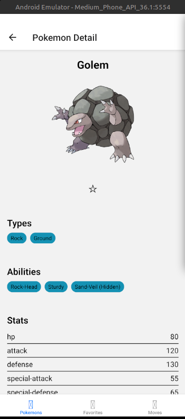
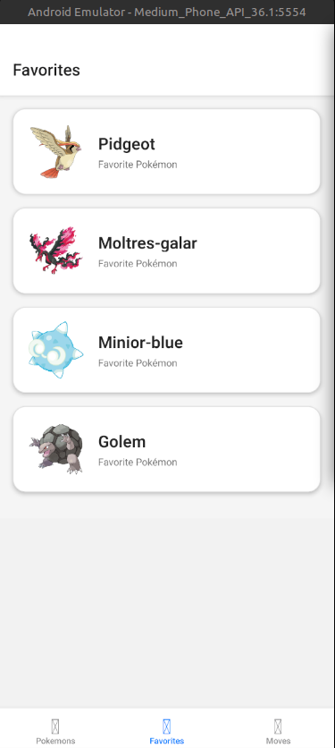
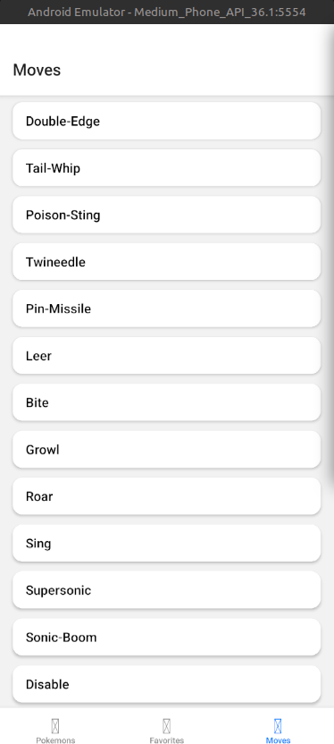

### Run app with expo
npm install
npm start

### Run app with development build
npm install
npm expo prebuild
npm start -d

### DTO from API
Para los modelos de la api fue usada la herramienta web https://app.quicktype.io/ para fácilmente creart los dto a partir de json

### Set Java Home
Para tener correcto el JAVA_HOME es necesario tener instalado Java 17, luego dependiendo del sistema operativo se establece de acuerdo a este:

En linux/mac
Abrir con editor de texto el archivo ~/.bashrc que se carga cada vez que se abre una terminal.
export JAVA_HOME=/usr/lib/jvm/java-17-openjdk-amd64
export PATH=$JAVA_HOME/bin:$PATH

En Windows hay que abrir las Variables de entorno y agregar una variable JAVA_HOME con valor de la ruta de instalación de Java17. Al mismo tiempo hay que agregar %JAVA_HOME%\bin al path.

### Requerimientos
Node v24.12.0
openjdk 17.0.18 2026-01-20
npm 11.6.2
expo sdk 52

### Arquitectura
Para el proyecto decidí usar algunos patrones usados en diversos proyectos de software y guiandome por los requerimeintos del documento.

src: La carpeta src contiene todos los archivos de código fuente del proyecto para dejar una estructura limpia
    feature: Aplicamos vertical slicing dividiendo nuetra aplicación por features desacoplando las funcionalidades de la app
    shared: Todo el código que concierte a toda la app, por ejemplo navegaciones, api client global con axios, y unos estilos que sirven de referencia para toda la app para tener un diseño consistente en la misma

## Carpeta features
En cada una de las carpetas encontraremos los mismos archivos pues están divididos en capa
1. Scren: Es el archivo que contiene la ui de react, importante que sólo debe llevar la estructura UI
2. Styles: Son los estilos de nuestro componente de la ui
3. State: Son los archivos que administran los estados de nuestra aplicación y la lógica de negocio, desde aquí generamente se llaman los services
4. Services: Son los métodos que nos ayudan hacer el fetching de nuestros datos de la api, esto usando el objeto apiClient con configuración precargada con tiemout, interceptors y baseURL
5. Dto: Modelos de las respuestas de nuestra api, muy útil objectos complejos.

Esta separación en capas de nuestra applicación nos permite tener una arquitectura escalable, testable y mantenible con lo cuál podemos tener un proyecto exitoso y tener contentos a nuestros clientes

### Navegación
La app al empezar esta dividida en 3 tabs: Pokemons, Favorites y Moves, de los cuales en cada uno hay un listado de las entidades que representan
Pokemons: Muestra un listado de pomkemons mientras al mismo tiempo tiene un buscador por tipo y por nombre, está información se almacena en caché para poder seguir navegando incluso sin internet y una paginación miesrtas se navega con flatlists. AL mismo tiempo al dar click sobre cada uno de los pokemons podemos ver información relevante a cada uno de ellosy ver una imagen. Desde esta vista es posible dar en favorito para guardar la información del pokemons en caché.

Favoritos: La sección de favoritos contiene images y nombre del pokemonn que se almacenó en la lista de pokemones, es importante notar que podemos ver esta lista de pokemones aún sin conexión

Moves: Listado sencillo de movimientos con faltlist para paginar las solicitudes a la api miestras se va realizando scroll

Librerías
Zustand para gestión de estados
FastIamge para mostrar imagenes
AsyncStorage para mantener la información en caché
Áxios para llamada a la api
react-navigation para la navegación 

[text](app-release.apk)